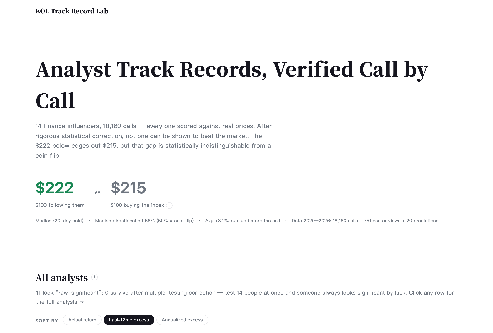
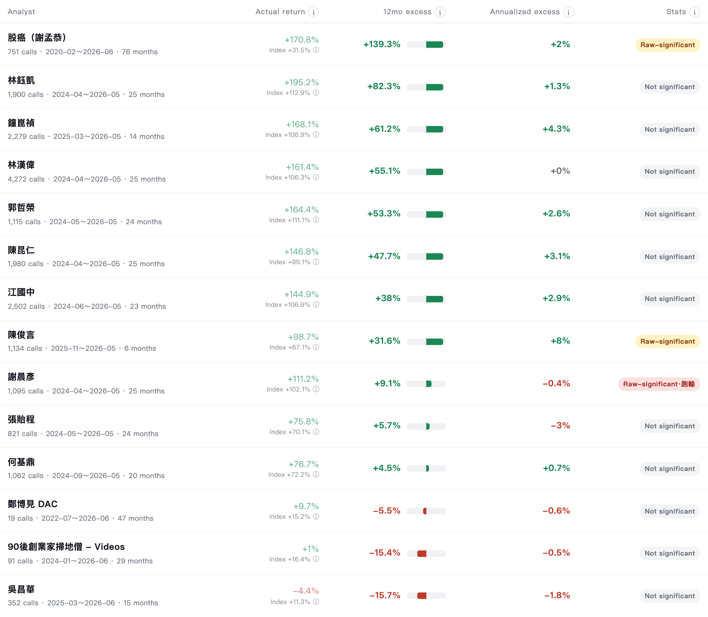
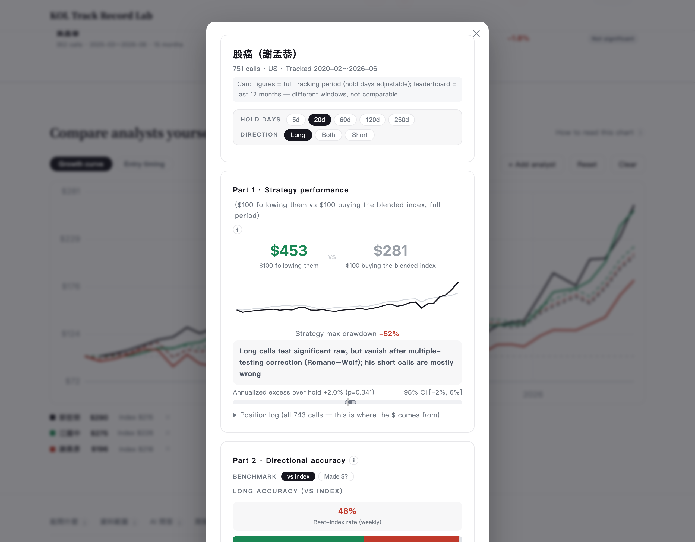
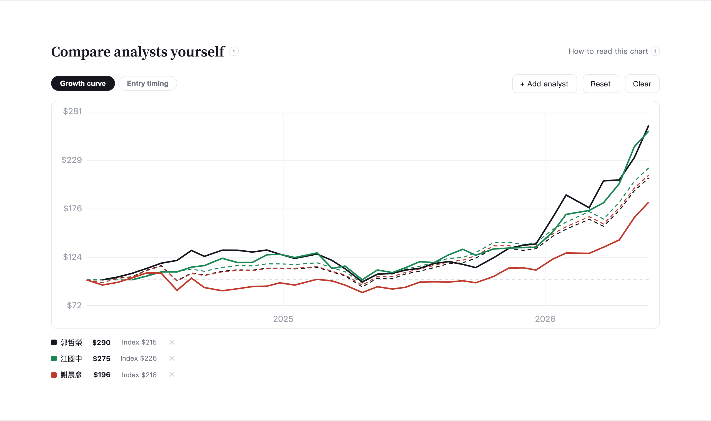
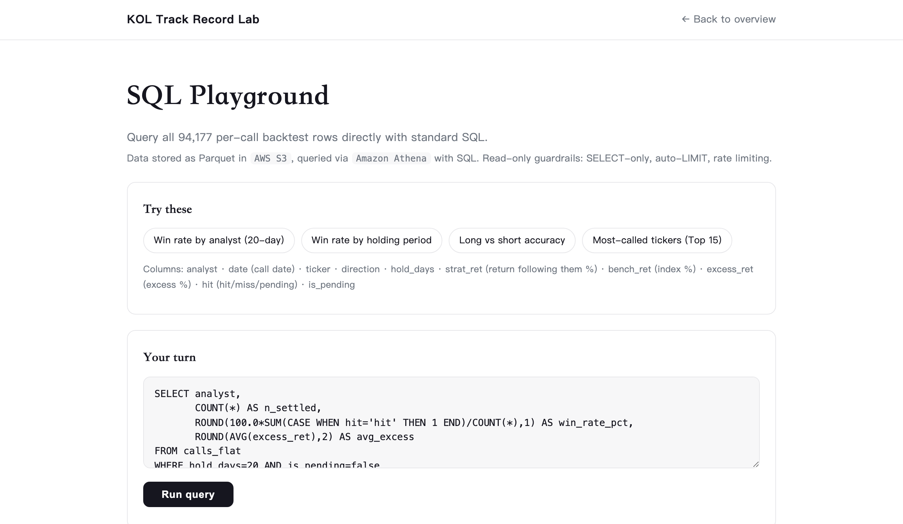

# KOL Track Record Lab — Do Taiwan's Finance Influencers Actually Beat the Market?

**In one sentence:** I scraped 4,500+ YouTube videos from 14 Taiwanese stock influencers,
turned every "buy this" into a backtestable trade, and ran the statistics honestly — the
answer is *no, not a single one of them beats the market once you account for luck.*

**🔗 Live site:** https://henrylin1009.github.io/KOL-Track-Record/ — permanent, always online.

**⚡ Full live demo:** http://13.238.128.215:8000 — the same app on AWS EC2, adding an interactive [SQL playground](http://13.238.128.215:8000/sql) (query the data live via Athena) and a natural-language Q&A agent.

*The demo runs on a free-tier instance and may be offline; the permanent site above always works.*

[](https://henrylin1009.github.io/KOL-Track-Record/)

> *The live interface is in Traditional Chinese because the source data is Chinese-language
> YouTube — the full pipeline (speech-to-text, LLM extraction, entity resolution) handles a
> non-English corpus end to end. The screenshots below are English renders of the same UI;
> analyst names are left in Chinese, as they are proper names.*

A rule-based backtesting and statistical-inference engine that evaluates **18,160 stock
calls** made by **14 Taiwanese finance influencers (KOLs)** on YouTube, and asks one
honest question of each: *once you correct for multiple testing, does any of them have
demonstrable skill?*

**Punchline:** raw backtests make several KOLs look like winners. After a
**Romano–Wolf stepwise multiple-testing correction** (family-wise error control across
all analysts × horizons), **0 of 14 survive.** Their apparent edge is a
false-discovery artifact of a bull market plus momentum-chasing.

---

## What it looks like

**Leaderboard** — every analyst scored on actual return, excess vs. the market, and a
significance verdict. Note the verdict column: several read *"Raw-significant"* — none
survive the multiple-testing correction.



**Per-analyst deep dive** (click any row) — a three-part scorecard: strategy $ curve vs.
buy-the-index, directional accuracy, and a "skill or luck?" breakdown with confidence
intervals and Romano–Wolf verdicts. Hold period and long/short direction are adjustable.



**Head-to-head comparison** — pit analysts against each other on a common growth curve,
each against their own per-call benchmark.



---

## Why this project

Finance influencers broadcast thousands of "buy this" calls but are never held to a
rigorous, look-ahead-free scorecard. The hard part isn't plotting an equity curve — it's
doing the statistics *honestly*: a per-call benchmark, no survivorship or look-ahead bias,
and a multiple-comparisons correction so that testing 14 people doesn't manufacture a
"genius" by chance.

## What it does

- **Extracts** buy/sell decisions and price predictions from 4,500+ YouTube transcripts
  using LLM tool-calling (`extract_decisions.py`, `extract_predictions.py`).
- **Backtests** every call in calendar time with a single unified rule
  (`build_calendar_multi.py`): open-of-next-session entry (no look-ahead), mark-to-market
  to a frozen backtest end date, 0.6% transaction cost on the strategy leg.
- **Benchmarks per call, not per person** (`resolve_target.py`, `verdict_rules.py`):
  a stock/sector pick is judged against its market index (TAIEX / SPY); a call *on* an
  asset itself (SPY, GLD, BTC…) is judged against buy-and-hold of that same asset —
  i.e. "did you beat the index?" vs. "did you at least get the direction right?"
- **Corrects for multiple testing** (`rw_core.py`): Romano–Wolf stepdown over the full
  family of analyst × horizon hypotheses under a shared "no skill" null.
- **Serves** a fully self-contained static site (`generate_site.py`) and a
  natural-language Q&A agent over the call database (`ask_combined.py`, `server.py`).

## Key numbers

| | |
|---|---|
| Analysts evaluated | 14 |
| Stock calls backtested | 18,160 |
| YouTube transcripts indexed | ~4,500 |
| Raw "significant" analysts | several |
| **Survive Romano–Wolf correction** | **0** |

## Statistical method

- **No look-ahead:** entry is the first tradable session *after* a call; the entire price
  history is truncated to a frozen `BACKTEST_END` so no run can peek at future prices.
- **Per-call benchmark routing:** the benchmark is chosen from the call's *target*, not
  the speaker — a rule (`benchmark_for`) maps each call to the right null.
- **Family-wise error control:** Romano–Wolf resampling accounts for correlation across
  hypotheses, unlike naive Bonferroni; this is what collapses the raw significance.
- **Regression-locked baselines** (`baseline_lock.json`, `regression_test.py`): headline
  numbers are pinned so any pipeline change that moves them fails a regression test.
- **Single source of truth:** every number on the site is computed from
  `calendar_multi.json` at build time — no hand-maintained figures.

## Tech stack

Python · pandas / numpy · yfinance · LLM tool-calling (DeepSeek / Claude) for extraction
and Q&A · FastAPI (`server.py`) for the local Q&A backend · a static HTML site generator
(`generate_site.py`) deployed to GitHub Pages.

## Cloud deployment (AWS)

The project runs in two tiers, keeping a permanent free tier alongside a full-featured
live deployment:

- **GitHub Pages** (permanent, static) — the leaderboard, analyst cards and charts.
- **AWS EC2** (full app) — the same site plus the two features a static host can't serve:
  the RAG Q&A agent and an interactive SQL playground.

**Data layer — S3 + Athena.** Every call is flattened across five holding horizons into a
94,177-row table (`export_calls.py`), stored as Parquet in **Amazon S3** and queried with
SQL through **Amazon Athena** (a serverless, scan-priced query engine over S3).

**Compute — EC2 + IAM.** `server.py` (FastAPI + the vector-RAG Q&A agent) runs on an
EC2 instance under `systemd`. The instance accesses Athena through an **IAM role**
(no long-lived keys on the box). `push_to_ec2.py` is a one-command deploy: rsync the
updated source and restart the service.

```
local dev  ──git push──▶  GitHub (source + Pages, permanent)
     │
     └──push_to_ec2.py──▶  EC2 (FastAPI + RAG + Athena SQL, live)
                              │
                    S3 (Parquet) ◀──Athena SQL── /sql playground
```

**SQL playground** (`/sql`, served by `sql.html` + `athena_query.py`) — visitors run their
own `SELECT` queries against the data live, with read-only guardrails (SELECT-only,
auto-`LIMIT`, per-IP rate limiting):



## Repository layout

```
build_calendar_multi.py   # the backtesting engine (calendar-time, per-call benchmark)
resolve_target.py         # maps each call to its target + benchmark
verdict_rules.py          # significance / verdict thresholds
rw_core.py                # Romano–Wolf multiple-testing correction
extract_decisions.py      # LLM extraction of buy/sell calls from transcripts
extract_predictions.py    # LLM extraction of price predictions
add_analyst.py            # one-command onboarding of a new analyst end-to-end
generate_site.py          # builds the self-contained index.html
ask_combined.py, server.py# natural-language Q&A agent + API (RAG + Athena SQL)
athena_query.py           # read-only Athena SQL runner (SELECT-only guardrails)
export_calls.py           # flatten backtest results to Parquet for S3/Athena
push_to_ec2.py            # one-command deploy to the EC2 live instance
manage.py                 # admin/deploy CLI (rebuild, recalc, publish)
calendar_multi.json       # single source of truth: all backtest results
METHODOLOGY.md            # full methodology write-up
ARCHITECTURE.md           # system architecture
```

## Reproducing locally

```bash
pip install -r requirements.txt
cp .env.example .env      # add your own API keys
python build_calendar_multi.py   # rebuild results (needs local price/transcript caches)
python generate_site.py          # regenerate the static site
```

> Note: raw data (price caches `*.pkl`, transcript DBs `*.db`, `data_cache/`) is **not**
> committed — it's large and partly personal-API-sourced. The committed
> `calendar_multi.json` lets you inspect the final results without rebuilding.

---

*Built by Henry Lin — Statistics & Economics, McGill University.*
